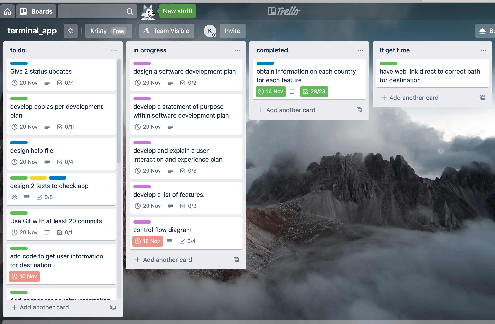
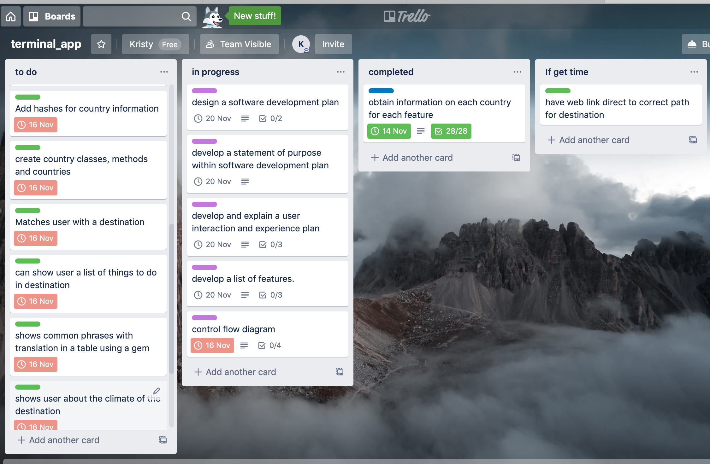
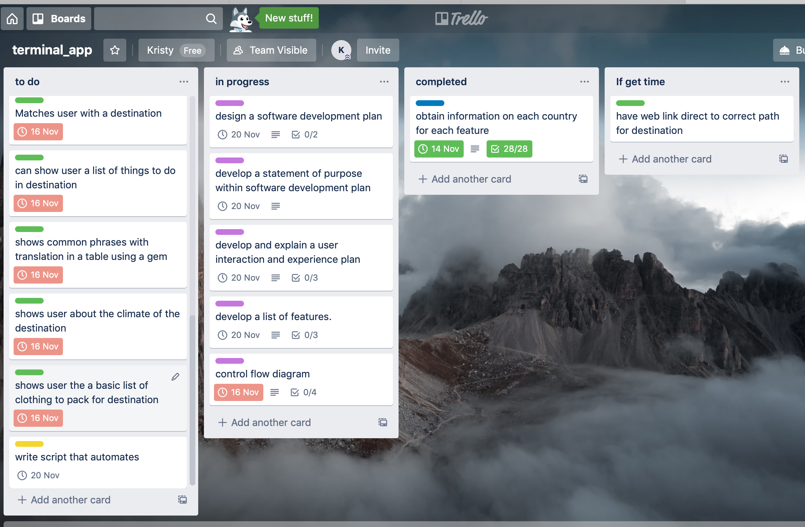
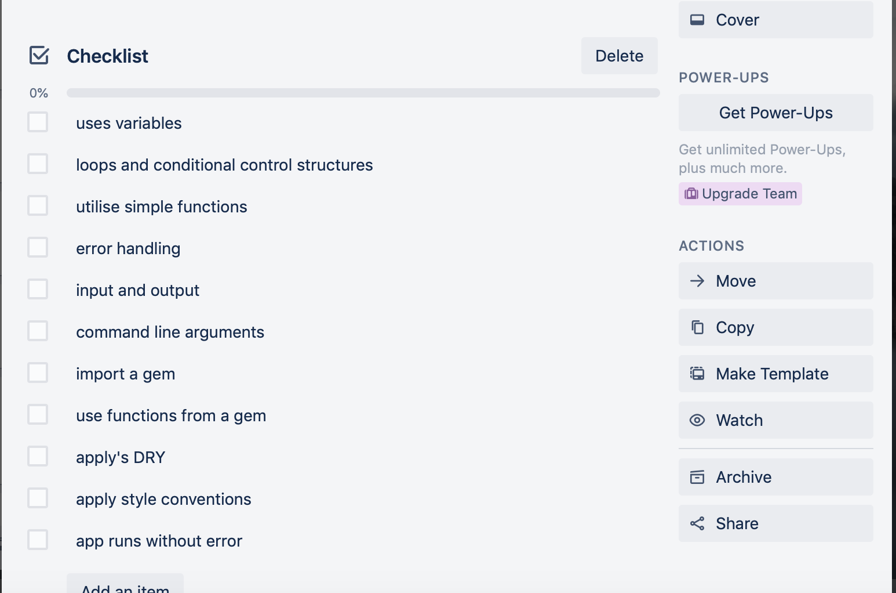

# Software Development Plan - Travel App

## Statement of Purpose & Scope

### Describe
The travel app take user input to suggest a destination that will fit with the users choices.
It will then give the user the option to select from a menu if they would like:
- Suggestions for things to do at the destination
- A table with translations of commonly used phrases for the destination. Utilizing English as the set language and then the most common language used in the destination.
- Some basic information in relation to climate of the destination
- A suggested list of what to pack for the destination
- A link to a booking site, to enable the user easy access to book flights and hotels.
### Identify & Explain
I believe people enjoy travel and a lot of the time people are looking for new destinations to travel to. It can take a while to research costs, information relating to things to do, climate, seasonal and other relevant information for destinations, especially if you are looking at multiple locations. This app addresses the problem of time available for research and looks to meet the user's requirements. The app narrows down what the user's budget is, their climate preference and the experiences they prefer. It will then give a suggestion based on their preferences. 
### Target Audience
The target audience is people who love to travel or are looking for a holiday however are short on time or prefer to take suggestions rather than spend time researching a destination that fits their requirements.
### Explain Use
The travel app will be utilized as a suggestion tool, which has already researched a range of destinations and then can present this information based on only what the user requires. It will be used prior to travel and prior to deciding where the user will be traveling to.

## Features
The app will include the following features:
- **Take in user input to determine an appropriate destination that fits their requirements**
utilizing user input the app will assign their preferences to corresponding variables and assign the destination to a corresponding variable. Using conditional if/elsif/else structures to either probe for further input information from the user or to then assign the user with a destination. The conditional else assists in error handling by allowing entry error to still assign an eligible destination based on previous input. I have also added a begin and rescue to assist in the event that the else fails. This will give an error to prompt the user to enter valid entries.
- **Present the user with a list of suggested activities to do at the chosen destination**
With the use of hashes and arrays to store the required information on each destination and then utilizing a class and relevant methods within, I have then added a Gem to present the user with a menu for them to select a list of things to do. With a Case/When and an until (the user quits )loop, the user selects the "What to do" menu item then a list of things to do will be presented to the user. They then can continue to select other options from there.
- **Present the user with a table of common phrases that are translated from the destinations most commonly used language**
With the use of hashes and arrays to store the required information on each destination and then utilizing a class and relevant methods within, I have then added a Gem to present the user with a menu for them to select a list of things to do. With a Case/When and an until (the user quits) loop, the user selects the "Get some common local phrases" menu item and then with the use of a Gem a table of common local phrases will be presented to the user. They then can continue to select other options from there.
- **Show the user some basic climate information for the destination**
With the use of hashes and arrays to store the required information on each destination and then utilizing a class and relevant methods within, I have then added a Gem to present the user with a menu for them to select a list of things to do. With a Case/When and an until (the user quits) loop, the user selects the "Need some climate info" menu item and a string of basic climate information for the destination will be presented to the user. They then can continue to select other options from there.
- **Show the user a list of what to pack for the destination**
With the use of hashes and arrays to store the required information on each destination and then utilizing a class and relevant methods within, I have then added a Gem to present the user with a menu for them to select a list of things to do. With a Case/When and an until (the user quits) loop, the user selects the "What to pack" menu item and a string of basic climate information for the destination will be presented to the user. They then can continue to select other options from there.
- **Link to a site to book flights and accommodation for the destination**
With the use of hashes and arrays to store the required information on each destination and then utilizing a class and relevant methods within, I have then added a Gem to present the user with a menu for them to select a list of things to do. With a Case/When and an until (the user quits) loop, the user selects the "book my flights" menu item and with the use of a Gem the user will be taken to an external booking website. They then can continue to select other options from there.

## User Interactions
The user will be provided with a help file that will include step by step instructions for use. The app itself guides and prompts the user with required actions. From the first instance the user will be asked to input a budget. The input has been given instructions to covert to an integer to assist in receiving the correct format. In the event that the user doesn't enter a valid response they will be offered a highly popular destination. If they have a low budget under $1,000 they will be advised that Bali is their destination however if the budget is higher they will be asked a series of questions which help direct the user to a valid destination. Throughout this process if the user makes an error the app has an else statement within which will take them to a destination which will likely align with their goals as they are quite popular and broad destinations which fit a variety of budgets, styles and climates. In the event that this was to fail there is also a begin/rescue in place to handle errors. In this event the user would see the following message "please enter a valid entry". 

Once all input has been received and a destination has been advised a menu pops up on the screen which the user can scroll up and down to select their choice. There is a "quit" item available to allow the user to exit at any point of this stage. This menu then allows the user to select the next lot of features. Using an until quit loop I have allowed the user to constantly see this menu so that at any point they will be able to change to another feature or exit the app.

The user will see the following instructions "please select from the following options (Use ↑/↓ arrow keys, press Enter to select)"
to help guide them on how to use the menu. The features themselves once selected with an enter key will automatically pop onto the screen and the book my flight option will automatically open a browser window and take them to the assigned URL.

The user will have access to the menu until they choose to quit.

## Implementation Plan on Project Management Platform - Trello
I have utilized a project management platform, Trello to track the development and outline the implementation plan for the app.
The outlines how the features will be implemented, has checklists within each step to track, prioritizes required stages and tasks, gives deadlines and durations for each feature and is categorized based on application, documentation, testing and then sorted into a to do list, in progress and completed. Please see below screen shots as examples and a link to the Trello board can be provided if needed for further reference.

